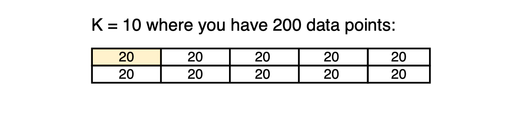

# Cross Validation

Cross Validation | Example code and own notes while taking the course "Intro to Machine Learning" on Udacity.

## Training, Transforms, Predicting

## Problems with splitting into training & testing data

### K-fold

Run K seperate learning experiments
- Pick testing set
- Train
- Test only testing set

⭐️Average test results from those K experiments.
